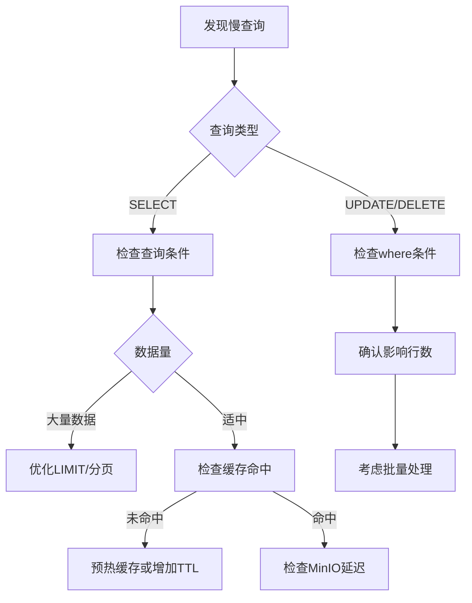

# MinIODB 故障排查指南

本文档提供MinIODB常见问题的诊断和解决方案，包括错误码说明、慢查询定位、恢复失败处理等。

## 目录
- [错误码参考](#错误码参考)
- [慢查询诊断](#慢查询诊断)
- [备份恢复故障](#备份恢复故障)
- [连接池问题](#连接池问题)
- [性能问题](#性能问题)
- [常见问题FAQ](#常见问题faq)

---

## 错误码参考

### gRPC错误码

| 错误码 | 说明 | 常见原因 | 解决方案 |
|-------|------|---------|---------|
| `InvalidArgument` (3) | 无效参数 | 表名不合法、SQL语法错误、必填字段缺失 | 检查请求参数格式，查看日志详细错误 |
| `NotFound` (5) | 资源不found | 表不存在、备份文件不存在 | 确认资源存在或使用`if_not_exists`选项 |
| `AlreadyExists` (6) | 资源已存在 | 创建已存在的表 | 使用`if_not_exists: true`或删除后重建 |
| `PermissionDenied` (7) | 权限拒绝 | JWT认证失败、token过期 | 检查token有效性，重新获取token |
| `ResourceExhausted` (8) | 资源耗尽 | 连接池满、缓冲区满、限流触发 | 扩容连接池或等待资源释放 |
| `FailedPrecondition` (9) | 前置条件失败 | 表未初始化、服务未就绪 | 等待服务就绪或检查依赖 |
| `DeadlineExceeded` (4) | 超时 | 查询超时、操作超时 | 优化查询或增加超时配置 |
| `Internal` (13) | 内部错误 | MinIO连接失败、Redis错误 | 查看日志详细stack trace |

### HTTP状态码

| 状态码 | 说明 | 场景 | 处理建议 |
|-------|------|-----|---------|
| 400 Bad Request | 请求格式错误 | JSON解析失败、参数类型错误 | 检查请求体格式 |
| 401 Unauthorized | 未认证 | 缺少Authorization头 | 添加Bearer token |
| 403 Forbidden | 禁止访问 | token无效或过期 | 重新获取token |
| 404 Not Found | 资源不存在 | 表、API端点不存在 | 确认URL和资源名 |
| 413 Request Entity Too Large | 请求体过大 | 超过10MB限制 | 减小请求大小或调整配置 |
| 429 Too Many Requests | 限流 | 超过速率限制 | 降低请求频率或申请提额 |
| 500 Internal Server Error | 服务器错误 | 内部异常 | 查看服务器日志 |
| 503 Service Unavailable | 服务不可用 | 服务启动中、依赖不可用 | 等待服务就绪 |

---

## 慢查询诊断

### 1. 识别慢查询

#### 通过Prometheus指标

```promql
# 查询P99时延超过5秒的表
histogram_quantile(0.99, 
  sum(rate(miniodb_query_duration_seconds_bucket[5m])) by (le, table)
) > 5

# 慢查询速率
rate(miniodb_slow_queries_total[5m])
```

#### 通过日志

慢查询会以`WARN`级别记录：

```json
{
  "level": "warn",
  "timestamp": "2025-10-03T10:30:45.123Z",
  "caller": "query/query.go:285",
  "msg": "Slow query detected",
  "table": "large_table",
  "sql": "SELECT * FROM large_table WHERE timestamp > 1696320000 ORDER BY timestamp DESC LIMIT 10000",
  "duration": 8.5,
  "threshold": 1.0
}
```

**关键日志字段**:
- `table`: 查询的表名
- `sql`: 完整SQL语句
- `duration`: 实际耗时（秒）
- `threshold`: 慢查询阈值（秒）

### 2. 慢查询定位流程



### 3. 定位工具

#### a. 查看查询统计

```bash
# 通过metrics端点
curl -s http://localhost:8080/metrics | grep miniodb_query_duration

# 输出示例
miniodb_query_duration_seconds_bucket{query_type="select",table="orders",le="0.01"} 145
miniodb_query_duration_seconds_bucket{query_type="select",table="orders",le="0.05"} 892
miniodb_query_duration_seconds_bucket{query_type="select",table="orders",le="0.1"} 1245
# ... P99在哪个bucket可以看出大致耗时分布
```

#### b. 分析日志模式

```bash
# 查找慢查询
grep "Slow query detected" /var/log/miniodb/app.log | tail -20

# 统计慢查询最多的表
grep "Slow query detected" /var/log/miniodb/app.log | \
  jq -r '.table' | sort | uniq -c | sort -rn

# 统计慢查询SQL模式
grep "Slow query detected" /var/log/miniodb/app.log | \
  jq -r '.sql' | sed 's/[0-9]\+/N/g' | sort | uniq -c | sort -rn
```

### 4. 优化建议

| 问题 | 症状 | 解决方案 |
|-----|------|---------|
| 全表扫描 | 查询无WHERE条件或条件覆盖大量数据 | 添加时间范围过滤、使用LIMIT |
| 缓存未命中 | 相同查询每次都慢 | 增加查询缓存TTL、预热缓存 |
| 文件过多 | 单表文件数>1000 | 手动触发刷新合并、调整分片策略 |
| MinIO慢 | 所有查询普遍慢 | 检查MinIO性能、网络延迟 |
| 内存不足 | 大结果集查询 | 使用流式查询、分页处理 |

---

## 备份恢复故障

### 1. 备份校验和失败

#### 症状

```json
{
  "level": "error",
  "msg": "Checksum mismatch",
  "backup_file": "backup_20251003_123045.json",
  "expected": "a1b2c3d4...",
  "calculated": "e5f6g7h8...",
  "error": "backup may be corrupted or tampered"
}
```

#### 诊断步骤

1. **验证备份完整性**
   ```bash
   # 手动验证校验和
   SHA256=$(cat backup_file.json | jq -r 'del(.checksum, .size)' | sha256sum | cut -d' ' -f1)
   STORED=$(cat backup_file.json | jq -r '.checksum')
   [ "$SHA256" = "$STORED" ] && echo "OK" || echo "MISMATCH"
   ```

2. **检查备份元数据**
   ```bash
   # 查看备份信息
   cat backup_file.json | jq '{node_id, timestamp, version, size, checksum}'
   ```

3. **查看备份日志**
   ```bash
   grep "performBackup" /var/log/miniodb/app.log | tail -20
   ```

#### 常见原因与解决

| 原因 | 表现 | 解决方案 |
|-----|------|---------|
| 文件传输损坏 | 下载/复制后校验失败 | 重新从MinIO下载原始备份 |
| 手动编辑 | 修改了备份文件内容 | 使用未修改的备份或接受风险恢复 |
| 版本不兼容 | 旧版本备份无校验和 | 升级后的备份才有校验和，旧备份会警告但继续 |
| 存储损坏 | 磁盘错误导致文件损坏 | 检查存储健康，使用备用备份 |

#### 绕过校验和（紧急情况）

⚠️ **仅在确认数据可信且紧急恢复时使用**

```bash
# 手动重新计算并更新校验和
NEW_CHECKSUM=$(cat backup.json | jq -r 'del(.checksum, .size)' | sha256sum | cut -d' ' -f1)
jq ".checksum = \"$NEW_CHECKSUM\"" backup.json > backup_fixed.json

# 使用修复后的文件恢复
curl -X POST http://localhost:8081/v1/metadata/restore \
  -H "Content-Type: application/json" \
  -d '{"backup_file": "backup_fixed.json", "validate": false}'
```

### 2. 并行恢复失败

#### 症状

```json
{
  "level": "error",
  "msg": "Parallel recovery completed with errors",
  "total": 10000,
  "ok": 9850,
  "error": 150,
  "errors": [
    "Worker 3: Failed to recover metadata:table1:key123: connection timeout",
    "Worker 7: Batch exec failed for 100 entries"
  ]
}
```

#### 诊断工具

**查看恢复日志**
```bash
# 过滤恢复相关日志
grep "RecoverFromBackup\|recoverEntriesParallel" /var/log/miniodb/app.log | tail -50

# 统计错误类型
grep "Failed to recover" /var/log/miniodb/app.log | \
  awk -F: '{print $NF}' | sort | uniq -c | sort -rn
```

**检查Redis连接**
```bash
# 测试Redis连接
redis-cli -h localhost -p 6379 PING

# 检查Redis性能
redis-cli --latency-history
```

#### 常见问题

| 问题 | 日志特征 | 解决方案 |
|-----|---------|---------|
| Redis超时 | `connection timeout`, `i/o timeout` | 增加Redis连接池、检查网络 |
| 批量执行失败 | `Batch exec failed` | 检查Redis内存、减小批量大小 |
| Worker崩溃 | `Worker N: panic recovered` | 查看panic stack trace，修复数据问题 |
| 部分数据冲突 | `key already exists` | 使用`overwrite: true`强制覆盖 |

#### 重试策略

```bash
# 1. 使用overwrite模式重试
curl -X POST http://localhost:8081/v1/metadata/restore \
  -H "Content-Type: application/json" \
  -d '{
    "backup_file": "backup_20251003.json",
    "overwrite": true,
    "parallel": true
  }'

# 2. 如果并行恢复不稳定，切换为串行模式
curl -X POST http://localhost:8081/v1/metadata/restore \
  -H "Content-Type: application/json" \
  -d '{
    "backup_file": "backup_20251003.json",
    "parallel": false
  }'

# 3. 使用dry_run模式预检查
curl -X POST http://localhost:8081/v1/metadata/restore \
  -H "Content-Type: application/json" \
  -d '{
    "backup_file": "backup_20251003.json",
    "dry_run": true
  }'
```

### 3. 启动一致性检查失败

#### 症状

服务启动时卡住或报错：

```log
[ERROR] Failed to perform startup sync: version conflict requires manual intervention
[ERROR] Redis version: v1.2.3, Backup version: v1.2.5
```

#### 诊断

```bash
# 1. 检查Redis版本信息
redis-cli GET metadata:version
redis-cli GET metadata:version:timestamp

# 2. 检查最新备份
curl http://localhost:8081/v1/metadata/backups?days=7 | jq '.backups[0]'

# 3. 查看启动日志
grep "performStartupSync\|getEnhancedVersionInfo" /var/log/miniodb/app.log | tail -30
```

#### 解决方案

**情况1：Redis版本较新**
```bash
# 自动触发安全备份（正常情况）
# 等待启动完成即可
```

**情况2：备份版本较新**
```bash
# 自动触发安全恢复（正常情况）
# 会创建快照用于回滚
```

**情况3：版本冲突**
```bash
# 手动决定使用哪个版本

# 选项A：保留Redis数据（丢弃备份）
redis-cli SET metadata:version:force_use_redis "true"
# 重启服务

# 选项B：使用备份数据（覆盖Redis）
curl -X POST http://localhost:8081/v1/metadata/restore \
  -d '{"from_latest": true, "overwrite": true}'
```

---

## 连接池问题

### 1. 连接池耗尽

#### 症状

```log
[CRITICAL] Redis connection pool utilization: 98%
[ERROR] Failed to acquire connection: pool exhausted
```

#### 实时诊断

```bash
# 查看连接池状态
curl -s http://localhost:8080/metrics | grep pool

# 输出示例
miniodb_redis_pool_active_conns{pool_name="main"} 48
miniodb_redis_pool_idle_conns{pool_name="main"} 2
miniodb_redis_pool_total_conns{pool_name="main"} 50
miniodb_redis_pool_utilization_percent{pool_name="main"} 96.0
```

#### 解决步骤

1. **临时缓解**（立即执行）
   ```yaml
   # 修改config.yaml
   network:
     pools:
       redis:
         pool_size: 100  # 从50增加到100
   ```
   重启服务

2. **排查泄漏**
   ```bash
   # 查找长时间持有连接的操作
   grep "duration.*[5-9]\." /var/log/miniodb/app.log | head -20
   
   # 查找未释放连接的panic
   grep "panic\|recovered" /var/log/miniodb/app.log
   ```

3. **优化查询**
   ```bash
   # 找出最慢的查询
   grep "Slow query" /var/log/miniodb/app.log | \
     jq -r '.duration' | sort -rn | head -10
   ```

### 2. MinIO连接池饱和

#### 症状
```log
[WARNING] MinIO connection pool utilization: 92%
[ERROR] Object upload timeout: context deadline exceeded
```

#### 诊断
```promql
# 查询MinIO池利用率
miniodb_minio_pool_utilization_percent

# 查询MinIO操作延迟
histogram_quantile(0.99, 
  sum(rate(olap_minio_operation_duration_seconds_bucket[5m])) by (le, operation)
)
```

#### 解决
- 检查MinIO服务健康: `mc admin info myminio`
- 检查网络延迟: `ping minio-server`
- 增加连接池大小或调整超时

---

## 性能问题

### 1. 写入性能下降

#### 症状
```promql
# 写入P99超过1秒
histogram_quantile(0.99, 
  sum(rate(miniodb_write_duration_seconds_bucket[5m])) by (le, table)
) > 1
```

#### 检查点

1. **缓冲区状态**
   ```bash
   curl -s http://localhost:8080/metrics | grep pending_writes
   # miniodb_pending_writes{table="orders"} 8500
   # 如果接近buffer_size(10000)说明写入速度超过刷新速度
   ```

2. **刷新性能**
   ```promql
   # 刷新耗时
   histogram_quantile(0.99, 
     sum(rate(miniodb_flush_duration_seconds_bucket[5m])) by (le, trigger)
   )
   ```

3. **MinIO存储性能**
   ```bash
   # 测试MinIO写入速度
   dd if=/dev/zero bs=1M count=100 | \
     mc pipe myminio/test-bucket/test-file
   ```

#### 优化方向
- 增加`buffer_size`
- 减少`flush_interval`
- 启用批量刷新
- 检查MinIO磁盘IO

### 2. 查询性能波动

#### 症状
查询时快时慢，P99/P50差距大

#### 分析
```bash
# 查看缓存命中率
curl -s http://localhost:8080/metrics | grep cache

# 查询缓存统计
miniodb_query_cache_hits_total
miniodb_query_cache_misses_total

# 计算命中率
hits / (hits + misses)
```

#### 调优
1. **增加缓存TTL**
   ```yaml
   query_optimization:
     metadata_cache_ttl: 10m  # 从5m增加
     local_file_index_ttl: 10m
   ```

2. **预热关键查询**
   ```bash
   # 启动后执行常见查询
   curl -X POST http://localhost:8081/v1/query \
     -d '{"sql": "SELECT * FROM hot_table LIMIT 1"}'
   ```

3. **启用智能缓存**
   ```yaml
   smart_cache:
     enabled: true
     adaptive_ttl: true
   ```

---

## 常见问题FAQ

### Q1: 服务启动失败，提示"failed to connect to Redis"

**A:** 检查Redis配置和服务状态
```bash
# 1. 确认Redis运行
systemctl status redis

# 2. 测试连接
redis-cli -h localhost -p 6379 PING

# 3. 检查配置
grep redis config.yaml

# 4. 如果使用单节点模式，确保enabled: false
network:
  pools:
    redis:
      enabled: false  # 单节点模式
```

### Q2: JWT认证失败

**A:** 检查token和配置
```bash
# 1. 获取新token
curl -X POST http://localhost:8081/v1/auth/token \
  -d '{"username":"admin","password":"password"}'

# 2. 验证token
curl http://localhost:8081/v1/tables \
  -H "Authorization: Bearer YOUR_TOKEN"

# 3. 如果想临时禁用认证
# 修改config.yaml
security:
  mode: "none"  # 或"jwt"
```

### Q3: 内存使用持续增长

**A:** 检查内存泄漏和缓存配置
```bash
# 1. 查看进程内存
ps aux | grep miniodb

# 2. 查看Go内存统计
curl http://localhost:8080/metrics | grep go_memstats

# 3. 调整缓冲区配置
concurrent_buffer_config:
  memory_threshold: 256MB  # 降低阈值
  enable_memory_flush: true  # 启用内存压力刷新

# 4. 手动触发GC
kill -USR1 <miniodb-pid>
```

### Q4: Grafana面板无数据

**A:** 检查Prometheus配置
```bash
# 1. 确认metrics可访问
curl http://localhost:8080/metrics

# 2. 检查Prometheus抓取状态
# 访问 http://localhost:9090/targets

# 3. 测试查询
curl -G http://localhost:9090/api/v1/query \
  --data-urlencode 'query=miniodb_writes_total'

# 4. 检查Grafana数据源
# Dashboard -> Settings -> Data Source
```

### Q5: 告警频繁触发后恢复

**A:** 调整告警阈值或增加for时间
```yaml
# prometheus-alerts.yml
- alert: RedisPoolHighUtilization
  expr: miniodb_redis_pool_utilization_percent > 90
  for: 5m  # 从2m增加到5m，减少误报
```

---

## 日志分析最佳实践

### 结构化日志字段

所有日志都是JSON格式，关键字段：

| 字段 | 说明 | 示例 |
|-----|------|-----|
| `level` | 日志级别 | info, warn, error |
| `timestamp` | ISO8601时间戳 | 2025-10-03T10:30:45.123Z |
| `caller` | 调用位置 | query/query.go:285 |
| `msg` | 消息 | Query executed successfully |
| `table` | 表名 | orders |
| `duration` | 耗时（秒） | 1.23 |
| `status` | 状态 | success, failed |
| `error` | 错误信息 | connection timeout |

### 常用日志查询

```bash
# 1. 查找错误
jq 'select(.level == "error")' /var/log/miniodb/app.log | tail -20

# 2. 查找特定表的操作
jq 'select(.table == "orders")' /var/log/miniodb/app.log | tail -20

# 3. 查找慢操作（>5秒）
jq 'select(.duration > 5)' /var/log/miniodb/app.log

# 4. 统计错误类型
jq -r 'select(.level == "error") | .error' /var/log/miniodb/app.log | \
  sort | uniq -c | sort -rn

# 5. 按表统计操作数
jq -r '.table' /var/log/miniodb/app.log | grep -v null | \
  sort | uniq -c | sort -rn
```

---

## 获取帮助

- **日志位置**: `/var/log/miniodb/app.log`
- **配置文件**: `/etc/miniodb/config.yaml`
- **Metrics端点**: `http://localhost:8080/metrics`
- **Health检查**: `http://localhost:8081/v1/health`
- **API文档**: `http://localhost:8081/swagger/`（如果启用）

**支持资源**:
- GitHub Issues: https://github.com/your-org/miniodb/issues
- 监控指南: `docs/ALERTING_GUIDE.md`
- 性能调优: `docs/PERFORMANCE_TUNING.md`

---

**文档版本**: v1.0  
**最后更新**: 2025-10-03  
**维护者**: MinIODB Team
